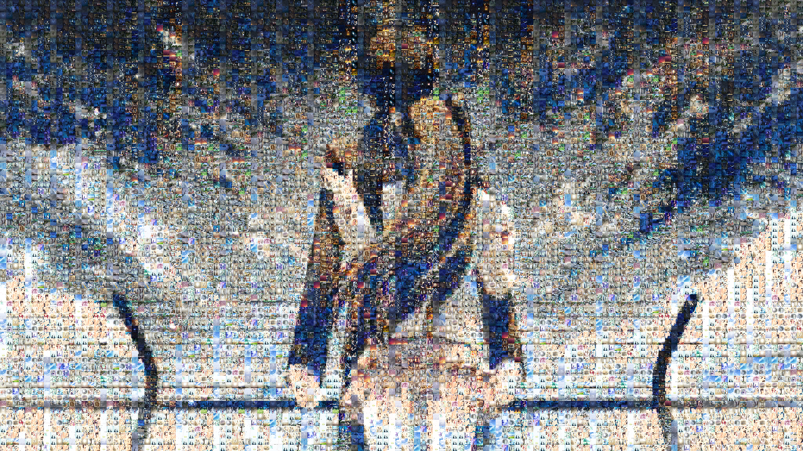

# Puzzle-your-image
This project is used to reconstruct the image with your own dataset. The target image will be reconstructed through patches from your dataset, and you can set the capacity rate for the original image, aka the background image.

# Setup
* Python 3.x
* PIL

# Running
 You can simply run the code through *python img_puzzle.py*. Please edit the code to modify the path of your dataset and input.
 
# Results
 The first image is the original image, the second one is the image reconstructed with capacity rate 0.4, and the third one ins the reconstructed one with no capacity.
 
 
 
 
